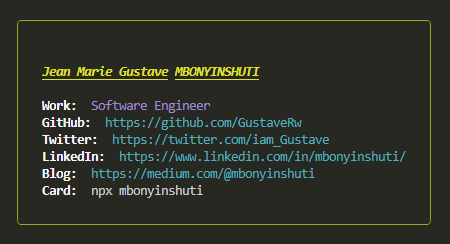

# 🏆 CLI Bio Links - Business Card

Generate easily your business card through the terminal (for nerds 🤓).

## 👨‍💻 Run my business card

```bash
npx mbonyinshuti
```

If you wish to reuse it, you can easily update the links in the `mbonyinshuti-info.json` file (the script will read from there 😄).

If you edit the script on your machine, you will have to run `npm link` to locally _symlink_ the package, and then run `mbonyinshuti` in your terminal.





## 👀 Heavily inspired by ...

This script was heavily inspired by [@HiDeaUp](https://github.com/HiDeaUp/)
